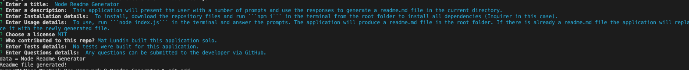

# Readme File Gen

## Description
  This application runs in the terminal, and will prompt the user for information. With that information it will generate a README file written in the Markdown language!

## Table of Contents
- [Installation](#installation)
- [Usage](#usage)
- [License](#license)
- [Contributing](#contributing)
- [Tests](#tests)
- [Questions](#questions)

## Installation
To install, clone the repository to your local system. From the terminal, within the root folder, run `npm i` to install the dependency (in this case, Inquirer.js).

## Usage
To use the README generator, run `node index.js` from your terminal. From there, just answer the questions! Once all prompts are answered, the file will be generated in the `readmeGen` folder.

If you wish you customize the prompts, you will need to edit the `questions` array in `index.js`. To then get the responses in your Markdown file, you will need to edit `/utils/generateMarkdown.js`.

## License
  

Copyright 2021 Mathew Lundin

Permission is hereby granted, free of charge, to any person obtaining a copy of this software and associated documentation files (the "Software"), to deal in the Software without restriction, including without limitation the rights to use, copy, modify, merge, publish, distribute, sublicense, and/or sell copies of the Software, and to permit persons to whom the Software is furnished to do so, subject to the following conditions:

The above copyright notice and this permission notice shall be included in all copies or substantial portions of the Software.

THE SOFTWARE IS PROVIDED "AS IS", WITHOUT WARRANTY OF ANY KIND, EXPRESS OR IMPLIED, INCLUDING BUT NOT LIMITED TO THE WARRANTIES OF MERCHANTABILITY, FITNESS FOR A PARTICULAR PURPOSE AND NONINFRINGEMENT. IN NO EVENT SHALL THE AUTHORS OR COPYRIGHT HOLDERS BE LIABLE FOR ANY CLAIM, DAMAGES OR OTHER LIABILITY, WHETHER IN AN ACTION OF CONTRACT, TORT OR OTHERWISE, ARISING FROM, OUT OF OR IN CONNECTION WITH THE SOFTWARE OR THE USE OR OTHER DEALINGS IN THE SOFTWARE.

  [MIT License](https://opensource.org/licenses/MIT)
    

## Contributing
This application was developed by Mat Lundin

## Tests
No tests were built for this application

## Questions
Any questions can be submitted to the developer via Github.

## Demonstration Video
(https://watch.screencastify.com/v/nd5chUSKdIMFoHUSbIYd)

You can access this repository [here.](https://martinfowler.com/bliki/TestDouble.html)

